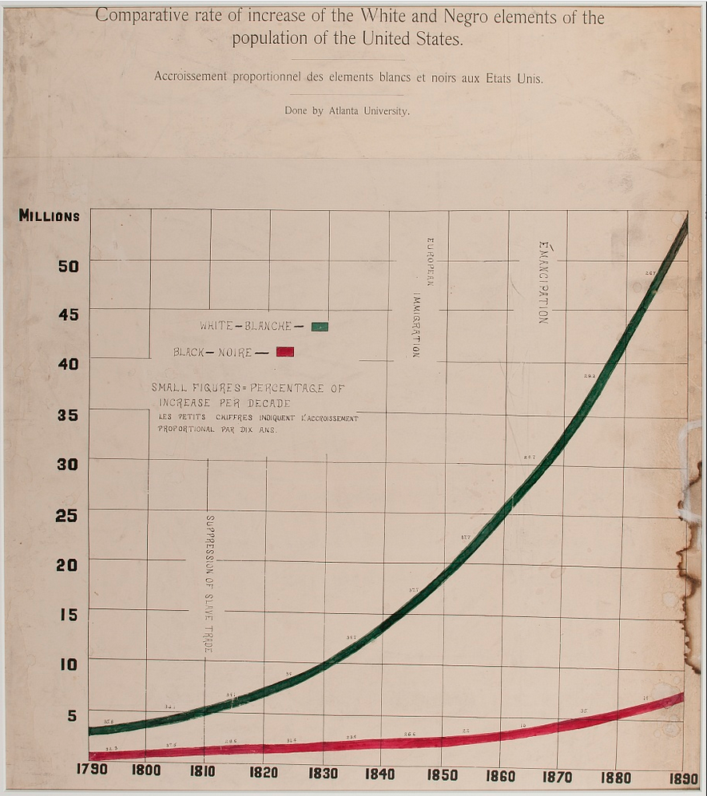
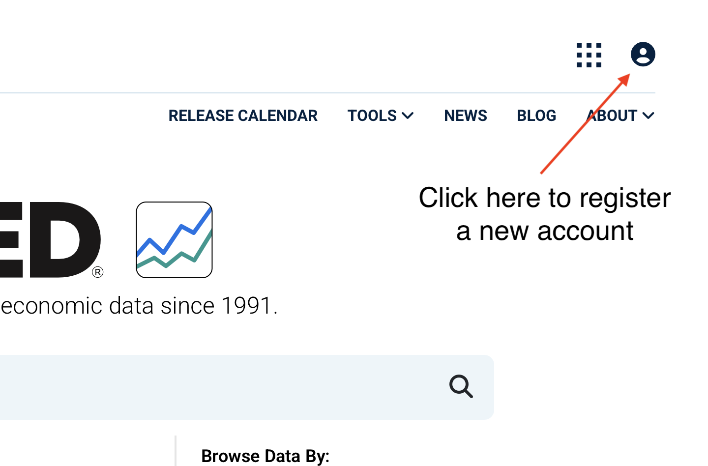
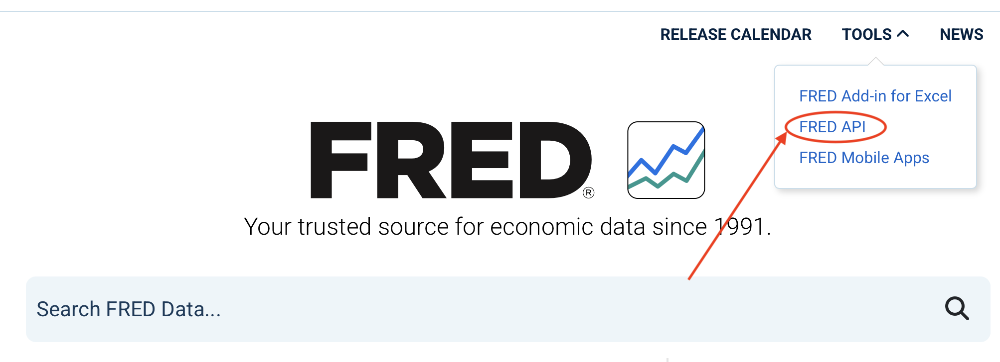
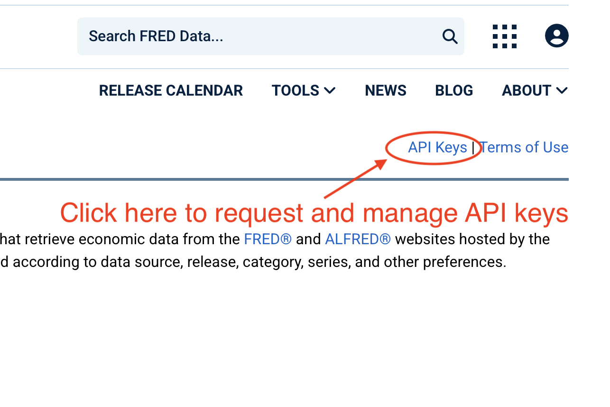
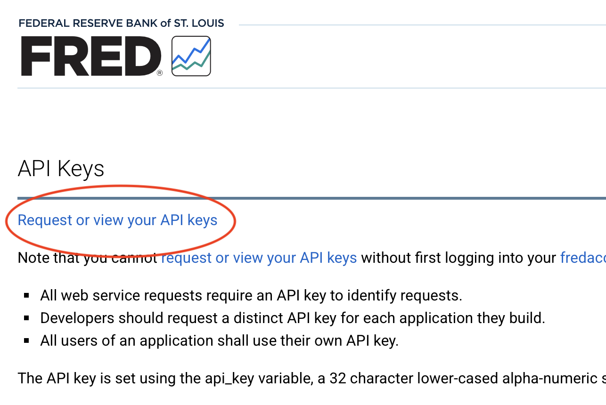
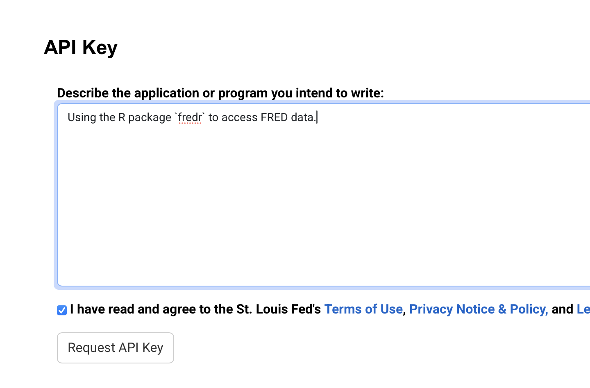

```{r setup}
#| include: false
#| echo: false

library(tidyverse)

file.copy(
    from='hw/homework_script.R',
    to='class_materials/homework_script.R',
    overwrite=TRUE
)

file.copy(
    from='hw/data/decade_pop.csv',
    to='class_materials/decade_pop.csv',
    overwrite=TRUE
)

```

```{r}
#| echo: false
#| message: false


# Import the raw data 
decade_pop <- read_csv("hw/data/decade_pop.csv")
```

## Part I: Importing Data from a File

During class, we *briefly discussed* the work of W. E. B. Du Bois and his team for the 1900 Paris Exposition. Please read the assigned reading ([https://towardsdatascience.com/w-e-b-du-bois-staggering-data-visualizations-areas- powerful-today-as-they-were-in-1900-64752c472ae4](https://towardsdatascience.com/w-e-b-du-bois-staggering-data-visualizations-areas-%20powerful-today-as-they-were-in-1900-64752c472ae4)). In one the of the charts included in the exhibit, "Comparative rate of increase of the White and Negro elements of the population of the United States", Du Bois plotted data on the population of the two groups between 1790 and 1890 in order to provide evidence against social darwinist theories of race from that era[^1].

[^1]: Aldon Morris (2018) "American Negro at Paris, 1900" in W. E. B. Du Bois's Data Portraits: Visualizing Black America, edited by Whitney Battle-Baptiste and Britt Rusert. Hudson, NY: Princeton Architectural Press.

{height="400px" fig-align='center'}

At the same time, population growth is a very important concept in economics, as it is a driver of the size of the labor force and therefore the size of the economy and the pace of economic growth.

In the rest of the homework, we will use an updated version of the data Du Bois used for this chart. We will walk you through downloading data on the population counts of Black and white Americans for each decade between 1790 and 2020, drawn from the decennial census[^2]. You will read the data into R, create new variables, produce a plot, and discuss the data. Upload a copy of the the script file to Canvas when finished.

[^2]: We have compiled these data from the Census Bureau and posted them on Canvas; the column "Source" lists the source of each data point. Note that before 2000, the Census recorded one racial category for each person. Starting in 2000, Census allowed respondents to select more than one race. The data we provide for 2000 - 2020 are for those who report only a single race -- only Black or African-American, and only white. For more information on race and ethnicity on the Census, particularly for 2020, please see [https://www.census.gov/content/dam/Census/newsroom/press-kits/2021/redistricting/20210812-presentation-redistricting-jones.pdf](https://www.census.gov/content/dam/Census/newsroom/press-kits/2021/redistricting/20210812-presentation-redistricting-jones.pdf).

#### Question 1 (1 pt)

**Create a new R script and upload the data.**

1.  If you have not already done so, create an Posit cloud account. Contact us for instructions or assistance.
2.  Open a new R script in Posit Cloud. Use this script to complete the rest of this assignment.
3.  Upload `decade_pop.csv` from the email we sent (moving forward homework files will be posted on Canvas).

#### Question 2 (3 pts)

**Import the data.** Write your R code in the script file you just opened.

1.  Install the `tidyverse` package if you have not yet already (`install.packages('tidyverse')`), and load it. This will load all of the packages required to complete this homework.
2.  Import the data from the CSV file into your R session. Assign it to an object called `decade_pop`.
    - Make sure to set your working directory to the appropriate location.

``` r
# Load the R packages required for the homework
# Use install.packages('tidyverse') if not already
# installed:
# install.packages('tidyverse')
library(tidyverse)

# Import the raw data
decade_pop <- read_csv("data/decade_pop.csv")
```

#### Question 3 (5 pts)

**Examine the data.** Write a few statements to familiarize an audience with the unaltered data. Be as succinct as possible. Include your written answers in the R script as commented lines. Include the following:

1.  Use an R function to display the first 6 rows of `decade_pop`
2.  Use an R function or the RStudio interface to determine the total number of rows of `decade_pop`. Write down the answer as a comment in the code. Explain which method you used to get your answer.
3.  Use an R function or the RStudio interface to determine the total number of columns in `decade_pop`. Write down the answer as a comment in the code. Include the column names and describe each column (data type, unit of measure, frequency, or other relevant details). Explain which method you used to get your answer.

#### Question 4 (2 pts)

**Compute summary statistics.**

1.  Use an R function to compute the following for all variables in `decade_pop`: mean, median, 1st quartile, 3rd quartile, minimum value, and maximum value.
2.  What changes do you think could be made to the data that would improve the readability and interpretability of our results?

## Part II: Importing Data from an API

External files (csv, xlsx, RData, sas7bdat, dta, etc) is still the primary way data is shared. Increasingly, however, data is accessed through APIs, or *application programming interfaces*. APIs allow us to access data directly, skipping the *download* and *import* steps entirely. This is important not only in the case of automated reports (like dashboards), but also in the case of creating a santized chain of custody for your data, eliminating a potential source of human error while improving the repeatability of your results.

FRED, or the *Federal Reserve Economic Database* hosted by the Federal Reserve Bank of St Louis, offers API connectivity through an easy-to-use R interface with the `fredr` package. In `Part II` we will register an account with FRED, request API keys, and recreate Friday's in-class exercise using unemployment data retrieved through the `fredr` package.



#### Question 5 (3 pts)

**Set up an account with FRED and requesting API keys**

1.  Go to [fred.stlouisfed.org](fred.stlouisfed.org), then click on the person icon in the in the top right-hand corner of the page to sign up for a new account (if you don't already have one).



2.  Once registered and logged in, clicking on the tools option at the top will reveal a dropdown. Click the `FRED API` option.





3.  From there, again in the top-right corner of the window, click on the link `API Keys`





4.  Then click `Request or view your API keys`





5.  In the text box, write a brief description that the API key is for the `fredr` package in R. Check the *Terms of Use* box, and then hit *Request API Key*. You should receive an automated email from FRED with your API key. It will also appear in the API Keys section of your account profile (accessed form the person icon at the top).





#### Question 6 (3 pts)

**Downloading `fredr`, passing it our API key, and requesting data**

1.  Install the `fredr` package with the command `install.packages('fredr')`.
2.  Load the library with `library(fredr)`.
3.  Then set the API key with `fredr_set_key("YOURKEYHERE")` (**NOTE** You will only have to do this once per R session).
4.  Lastly, use the `fredr` function to request the **monthly** series `UNRATE` from 1950 through the end of 2024 (**HINT:** `fredr`'s documentation can be quite helpful if you get stuck <https://cran.r-project.org/web/packages/fredr/vignettes/fredr.html>), saving the output to the dataframe `unemp_1950_2024`. In comments, describe the data (number and frequency of observations, start/end date, units of measurement, etc).

#### Question 7 (2 pts)

1.  Create two dataframes from `unemp_1950_2024`, one containing the monthly unemployment rate from 1950 through the end of 1986, and one containing the monthly unemployment rate from 1987 through the end of 2024.
2.  Compute summary statistics on each and compare.
